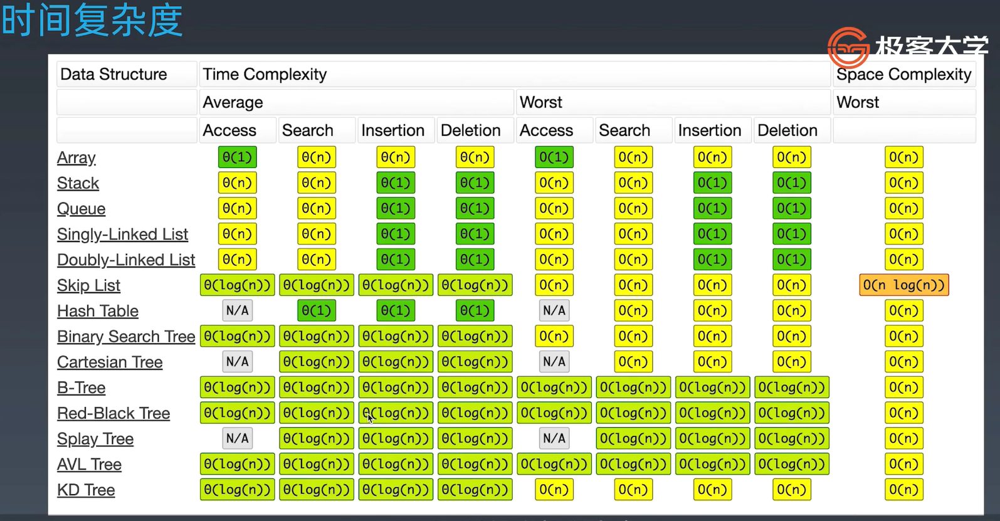

# 毕业总结

## 数据结构

- 一维
  - 基础
    - 数组 array（string）
    - 链表 linked list
  - 高级
    - 栈 stack
    - 队列 queue
    - 双端队列 deque（Java官方推荐的stack使用数据结构）
    - 集合 set (hash or tree)
      - hash 修改和查找 O(1)，tree由于是二叉搜索树都是O(logn)的
    - 映射 map (hash or tree)
      - hash 修改和查找 O(1)，tree由于是二叉搜索树都是O(logn)的
- 二维
  - 基础
    - 树 tree
    - 图 graph
  - 高级
    - 二叉搜索树 binary search tree (red-black tree, AVL)
    - 堆 heap
    - 并查集 disjoint set
    - 字典树 Trie
- 特殊
  - 位运算 bitwise
  - 布隆过滤器 BloomFilter
  - LRU Cache

## 时间复杂度

## 算法

- If-else, switch —> branch

- for, while loop —> Iteration

- 递归 Recursion (Devide & Conquer, Backtrace)

- 搜索 Search：深度优先搜索 Depth first search, 广度优先搜索 Breadth first search, A*

- 动态规划 Dynamic Programming

- 二分查找 Binary Search

- 贪心 Greedy

- 数学 Math, 几何 Geometry

### 常见时间复杂度

## 化繁为简的思想

1. 人肉递归低效、很累
2. 找到最近最简方法，将其拆解成可重复解决的问题
3. 数学归纳法思维

本质：寻找重复性 —> 计算机指令集

## 学习要点

- 基本功是区别业余和职业选手的根本。深厚功底来自于 — 过遍数
- 最大的误区：只做一遍
- 五毒神掌
- 刻意练习 — 练习缺陷弱点地方、不舒服、枯燥
- 反馈 — 看题解、看国际版的高票回答

## 经典习题

爬楼梯、硬币兑换

括号匹配、括号生成、直方图最大面积、滑动窗口

二叉树遍历、分层输出树、判断二叉排序树

股票买卖、偷房子、字符串编辑距离、最长上升子序列、最长公共子序列

异位词（判断和归类）、回文串（最大回文串）、regex 和通配符匹配

高级数据结构（Trie、BloomFilter、LRU cache）

## 五毒神掌

第一遍：不要死磕，要看代码学习（一定要看国际版高票回答）

第二遍：自己写

第三遍：24 小时后

第四遍：一周后

第五遍：面试前

## 面试技巧

1. Clarification：明确题目意思、边界、数据规模
2. Possible solution：穷尽所能的解法
   1. compare time/space
   2. optimal solution
3. Coding：代码简洁、高性能、美感 https://shimo.im/docs/rHTyt8hcpT6D9Tj8
4. Test cases

## Commencement

Steve Jobs: https://www.youtube.com/watch?v=Hd_ptbiPoXM

至少熟悉了各种数据结构的基本概念，然后有了学习方法，之后可能还要更多的练习算法题目，也去更加细致了解各个数据结构和算法的知识，需要更长久的刻意练习才能真正的掌握。