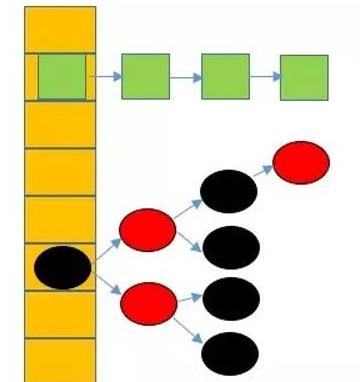

[toc]

## 学习笔记

**与课堂笔记区分，用于记录学习总结。**

### HashMap

哈希也叫散列，是一种非常重要的数据结构，许多缓存技术的核心就是在内存中维护了一张大的哈希表。

#### hash冲突

所谓的哈希冲突，也叫哈希碰撞。前面我们提到过，哈希函数的设计至关重要，好的哈希函数会尽可能地保证计算简单和散列地址分布均匀,但是，我们需要清楚的是，数组是一块连续的固定长度的内存空间，再好的哈希函数也不能保证得到的存储地址绝对不发生冲突。

哈希冲突的解决方案有多种:开放定址法（发生冲突，继续寻找下一块未被占用的存储地址），再散列函数法，链地址法，而HashMap即是采用了链地址法，也就是数组+链表的方式。

#### JDK8中HashMap的实现原理

在JDK1.8之前，HashMap采用数组+链表实现，使用链表来处理冲突，同一hash值的节点都存储在一个链表里。但是当位于一个桶中的元素较多，即hash值相等的元素越来越多时，链表也会越来越长，通过key值依次查找的效率也会越来越低，查找退化成O(n)。

而JDK1.8中，HashMap采用数组+链表+红黑树实现，当链表长度超过阈值（8）时，将链表转换为红黑树，查找时间复杂度为O(logn)。

 

#### 总结

1. JDK1.8之后HashMap底层是数组+链表+红黑树。

2. HashMap线程不安全，可以使用Collections.synchronizedMap()包装为线程安全或者使用HashTable，CurrentHashMap。

3. HashMap的默认初始容量为16，加载因子是0.75，填充度达到75%后，会扩容至原来的2倍。

4. HashMap对象的key、value值均可为null；HahTable对象的key、value值均不可为null。两者的的key值均不能重复，若添加key相同的键值对，后面的value会自动覆盖前面的value，但不会报错。

### 参考网址

[HashMap源码分析](https://zhuanlan.zhihu.com/p/72296421)