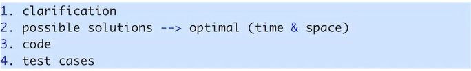
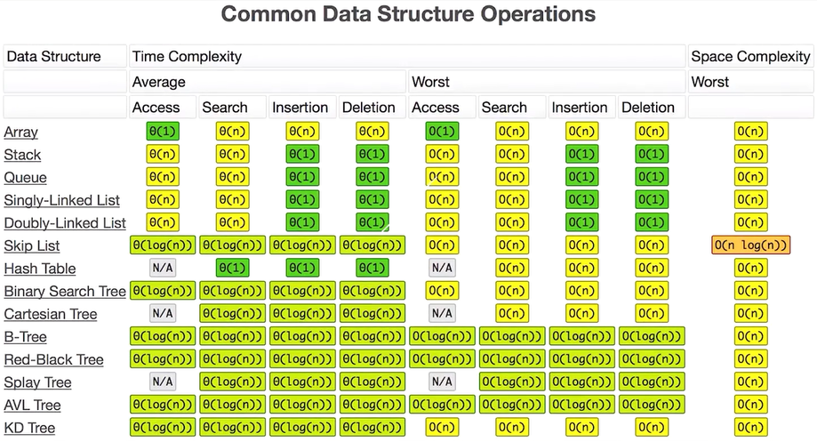
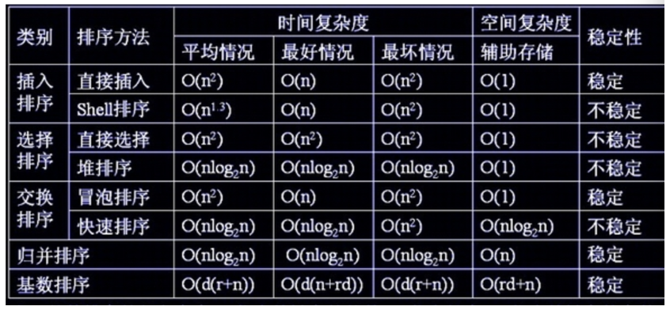
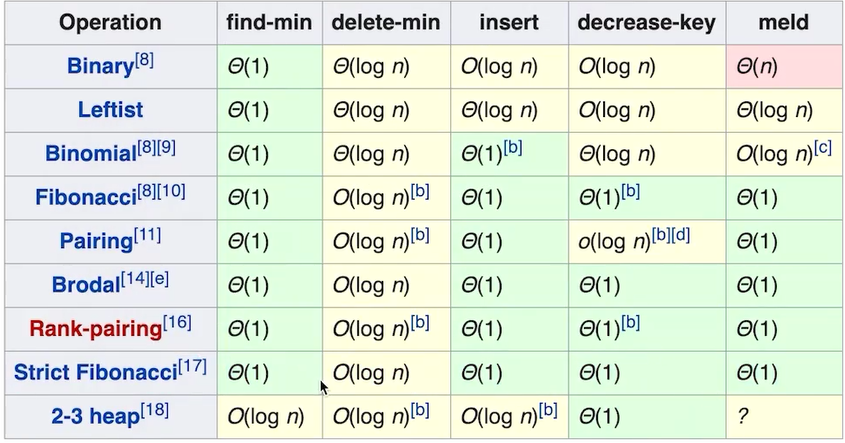
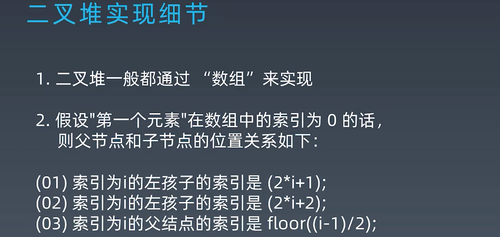
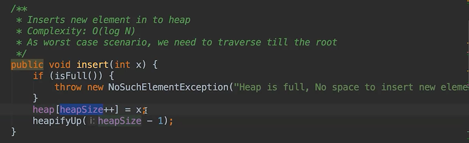
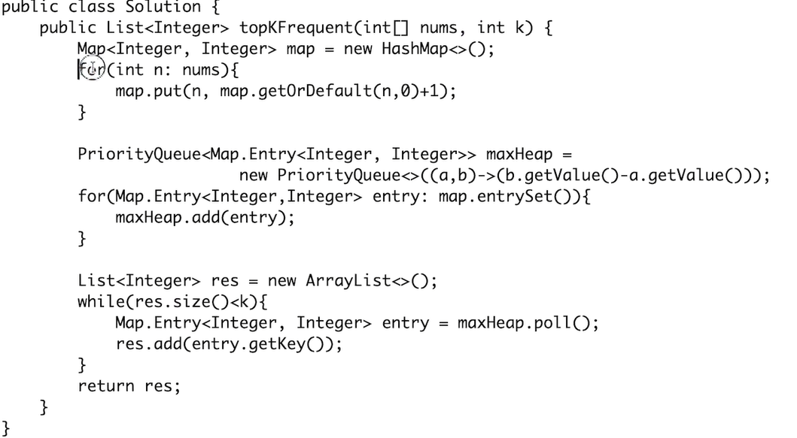

[toc]

## 课堂笔记

#### 解题四件套

 


### 一、常见的数据结构的复杂度



**常见的时间复杂度是O(nlogn)的操作有哪些？**



shell 排序的平均时间复杂度O(n·log2n)，此处2为底数。空间复杂度o(1)，不稳定，正序效率最高，反序效率最低。上表中，为O(n^1.3)。

一般说时间复杂度，底数会忽略即O(logn)。

明确一点，数据结构本身不涉及时间复杂度分析，对数据结构的各类操作处理才有了时间复杂度分析。

### 二、二叉树的遍历

前序、中序、后序三种方式。

递归的状态树需要找对，递归本身是不会有很高的时间复杂度；由于计算机存储方式和编译器对于尾递归的优化，现在一般认为递归和迭代的效率是一样的。

**二叉树的遍历套用课上的模板即可，需要非常的熟练。**


### 三、Heap 与 Binary Heap

二叉堆满足的完全二叉树的性质，它并不是最优的堆，严格斐波那契堆就比二叉堆优秀。meld 合并



#### 二叉堆可以用一维数组存储



#### insert操作，堆尾插入元素，然后从下往上调整堆



```java
private void heapifyUp(int i) {
    int insertValue = heap[i];
    while (i > 0 && insertValue > heap[parent(i)]) {
        heap[i] = heap[parent(i)];
        i = parent[i];
    }
    heap[i] = insertValue;
}
```

#### delete操作，取堆尾元素放到删除的堆顶元素位置，然后从上往下调整堆


#### 数据结构的操作算法复杂度涉及O(nlogn)?（6.3）

字符串的快速排序时间复杂度O(nlogn)。（5.2）

如果只是维护一个数组，每次有新元素insert，就需要把整个数组排序，那么时间复杂度自然也来到了O(nlogn)。

在跳表这一节讲到跳表是对标AVL和BinarySearch的一种insert/delete/search都是O(logn)的数据结构。


#### HashMap 课堂例题关于取出默认值的

滑动窗口




### 参考网址

[排序的时间复杂度](https://www.cnblogs.com/wuxiangli/p/6399266.html)

[shell 排序](https://www.shiyanlou.com/questions/1993/)


### TODO

1、number of island lc 200 之前未见使用 DFS 求解，这一章节才接触 DFS。

2、课程课表 word 文档对应更新